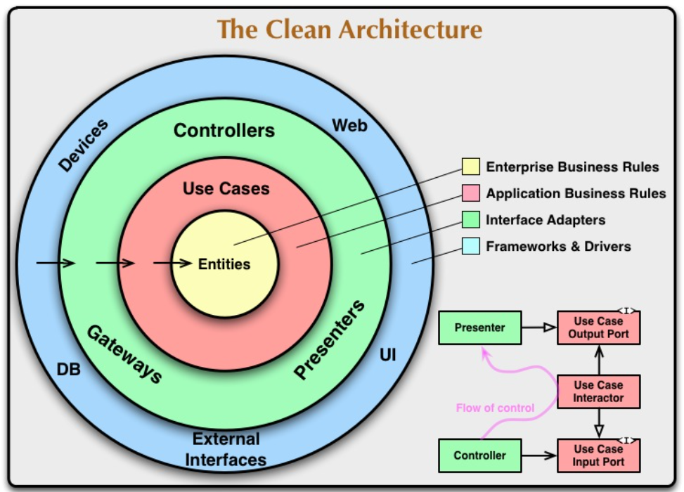

# Clean Architecture

This repository provides a practical example of implementing Clean Architecture using Spring Boot and JSP. It is designed to help understand the principles of Clean Architecture while also learning how to create front-end views with JSP.

## What is clean-architecture?

Clean architecture is a software architectural pattern introduced by Robert C. Martin.
Clean architecture is also a way to design an application so that the code is organized, well-structured, and easy to develop or change. 
The main principle is to separate different parts of the application into layers that don’t depend on each other. 
For example, the business logic (the rules of the application) shouldn’t rely on technical details like the database or the user interface.

With clean architecture, each layer has its own responsibility, so if something changes in one part (like switching the database), other parts don’t need to be changed. 
This makes the application more flexible and easier to maintain.

## Code Separation in Layers of Different Levels 

To explain this concept We can see in the diagram that the original version of the CA contains four distinct layers:

- Entities: Business rules and encapsulates data and core business functions.
- Use Cases: Application-specific logic and rules that orchestrate the flow of data to and from the entities to achieve the goals of a specific use case.
- Interface Adapters: Glues the UI, database, and backend with use cases, and contains the implementations of data source interfaces and communication with external systems.
- Frameworks & Drivers: Includes the mobile framework code, platform-specific classes, and third-party libraries.

## The Dependency Rule 

The Dependency Rule states that dependencies should only point inwards, and inner layers should not be aware of outer layers.

## Dependency Inversion

Dependency Inversion is a key principle of CA, where dependencies are inverted by depending on abstractions rather than concrete implementations. This enables the swapping of dependencies and facilitates testability.

## Benefits of Clean Architecture
(+) separation of concerns,

(+) testability,

(+) robustness,

(+) and readability
